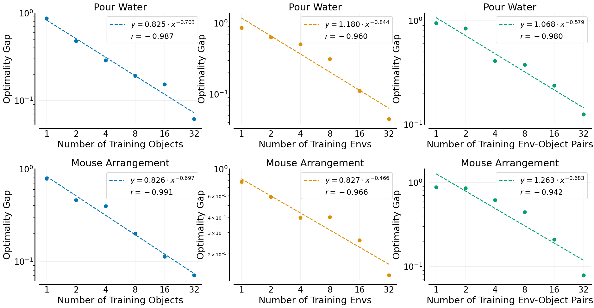

# Data Scaling Laws in Imitation Learning for Robotic Manipulation

[[Project Page]](https://data-scaling-laws.github.io/)
[[Paper]](https://data-scaling-laws.github.io/paper.pdf)
[[Models]](https://huggingface.co/Fanqi-Lin/Task-Models/tree/main)
[[Processed Dataset]](https://huggingface.co/datasets/Fanqi-Lin/Processed-Task-Dataset/tree/main)
[[Raw GoPro Videos]](https://huggingface.co/datasets/Fanqi-Lin/GoPro-Raw-Videos)

<p>
    
    
</p>

[Fanqi Lin](https://fanqi-lin.github.io/)<sup>1,2,3\*</sup>,
[Yingdong Hu](https://yingdong-hu.github.io/)<sup>1,2,3\*</sup>,
Pingyue Sheng<sup>1</sup>,
[Chuan Wen](https://alvinwen428.github.io/)<sup>1,2,3</sup>,
[Jiacheng You](https://scholar.google.com/citations?user=FiP-TVUAAAAJ)<sup>1</sup>,
[Yang Gao](https://yang-gao.weebly.com/)<sup>1,2,3</sup>,

<sup>1</sup>Tsinghua University,
<sup>2</sup>Shanghai Qi Zhi Institute,
<sup>3</sup>Shanghai Artificial Intelligence Laboratory

<sup>\*</sup> indicates equal contributions

## 🛠️ Installation
See the [UMI repository](https://github.com/real-stanford/universal_manipulation_interface) for installation. 

## 📷 Data
We release data for all four of our tasks: *pour water, arrange mouse, fold towel*, and *unplug charger*. You can view or download all raw GoPro videos from this [link](https://huggingface.co/datasets/Fanqi-Lin/GoPro-Raw-Videos), and generate the dataset for training by running:

```shell
bash run_slam.sh && bash run_generate_dataset.sh
```

Alternatively, we provide processed dataset [here](https://huggingface.co/datasets/Fanqi-Lin/Processed-Task-Dataset/tree/main), ready for direct use in training.

You can visualize the dataset with a simple script:
```shell
python visualize_dataset.py
```

## 🦾 Real-World Evaluation
For the hardware setup, please refer to the [UMI repo](https://github.com/real-stanford/universal_manipulation_interface) (note: we remove the mirror from the gripper, see [link](https://drive.google.com/drive/folders/1DLGfRWYvODOnHwn9Ye-xWlYhXk0WwBGG?usp=sharing)).

For each task, we release a policy trained on data collected from 32 unique environment-object pairs, with 50 demonstrations per environment. These polices generalize well to any new environment and new object. You can download them from [link](https://huggingface.co/Fanqi-Lin/Task-Models/tree/main) and run real-world evaluation using:

```shell
bash eval.sh
```

The ```temporal_agg``` parameter in eval.sh refers to temporal ensemble strategy mentioned in our paper, enabling smoother robot actions.

Additionally, you can use the ```-j``` parameter to reset the robot arm to a fixed initial position (make sure that the initial joint configuration specified in ```example/eval_robots_config.yaml``` is safe for your robot !!!).

## 📊 Reproducing Data Scaling Laws
After downloading the [processed dataset](https://huggingface.co/datasets/Fanqi-Lin/Processed-Task-Dataset/tree/main), you can train a policy by running:

```shell
cd train_scripts && bash <task_name>.sh
```

For multi-GPU training, configure your setup with ```accelerate config```, then replace ```python``` with ```accelerate launch``` in the ```<task_name>.sh``` script. Additionally, you can speed up training without sacrificing policy performance by adding the ```--mixed_precision 'bf16'``` argument.

Note that for the pour_water and unplug_charger tasks, we incorporate an additional step of historical observation for policy training and inference.

The current parameters in the ```<task_name.sh>``` scripts correspond to our released [models](https://huggingface.co/Fanqi-Lin/Task-Models/tree/main), but you can customize training:
+ Use ```policy.obs_encoder.model_name``` to specify the type of vision encoder for the diffusion policy. Other options include ```vit_base_patch14_dinov2.lvd142m``` (DINOv2 ViT-Base) and ```vit_large_patch14_clip_224.openai``` (CLIP ViT-Large).
+ To adjust the number of training environment-object pairs (up to a maximum of 32), modify ```task.dataset.dataset_idx```. You can change the proportion of demonstrations used by adjusting ```task.dataset.use_ratio``` within the range (0, 1]. Training policies on data from different environment-object pairs, using 100% of the demonstrations, generates scaling curves similar to the following:



The curve (third column) shows that the policy’s ability to generalize to new environments and objects scales approximately as a power law with the number of training environment-object pairs.

## 🙏 Acknowledgement
We thank the authors of [UMI](https://github.com/real-stanford/universal_manipulation_interface) for sharing their codebase.
