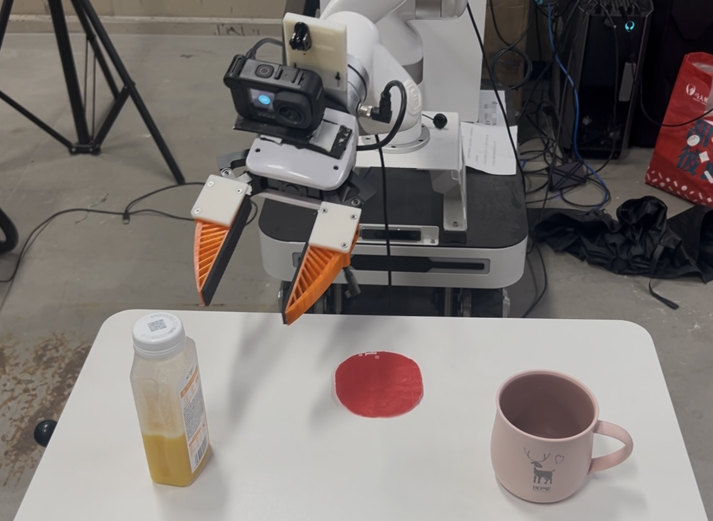

# Deploy UMI Policy on xArm Robot


## System Overview

* XArmInterface (Server): [scripts_real/launch_xarm_interface_server.py](scripts_real/launch_xarm_interface_server.py) (L14)

* XArmInterface (Client): [umi/real_world/xarm_interpolation_controller.py](umi/real_world/xarm_interpolation_controller.py) (L39)

* *XArmInterpolationController*:  [umi/real_world/xarm_interpolation_controller.py](umi/real_world/xarm_interpolation_controller.py) (L109)

* *XArmGripperController*：[umi/real_world/xarm_gripper_controller.py](umi/real_world/xarm_gripper_controller.py) (L19)

> Unlike the UR/Franka, both the xArm arm and gripper use the same server and client.
>
> And thanks to [Fast-UMI](https://fastumi.com/), we do not need to buy the expensive WSG gripper. (^-^)

## Instructions

* Install [zerorpc](https://www.zerorpc.io/) and [xArm-Python-SDK](https://github.com/xArm-Developer/xArm-Python-SDK)

  ```bash
  pip install zerorpc
  pip install xarm-python-sdk
  ```

* Launch XArmInterface Server on NUC.

  `python scripts_real/launch_franka_interface_server.py`

* Obtain IP address and update [eval_xarm_config.yaml](example/eval_xarm_config.yaml)/robots/robot_ip.

* Download ckpt from [Data-Scaling-Laws](https://huggingface.co/Fanqi-Lin/Task-Models/tree/main), and place them in `\data` following [Data-Scaling-Laws](https://github.com/Fanqi-Lin/Data-Scaling-Laws)

* Then you should be able to launch the evaluation on the xArm.

  ```bash
  bash eval.sh
  ```
  
  
  
  
